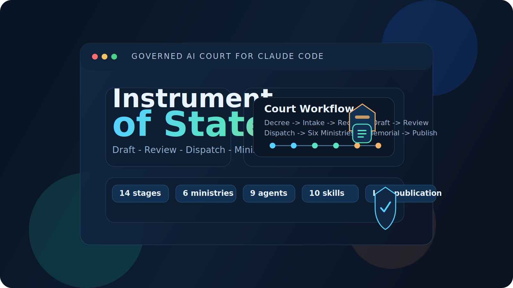
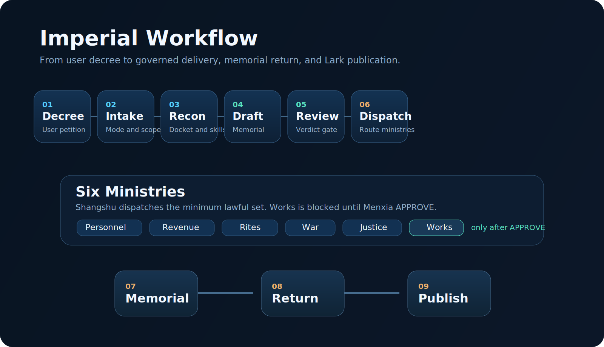
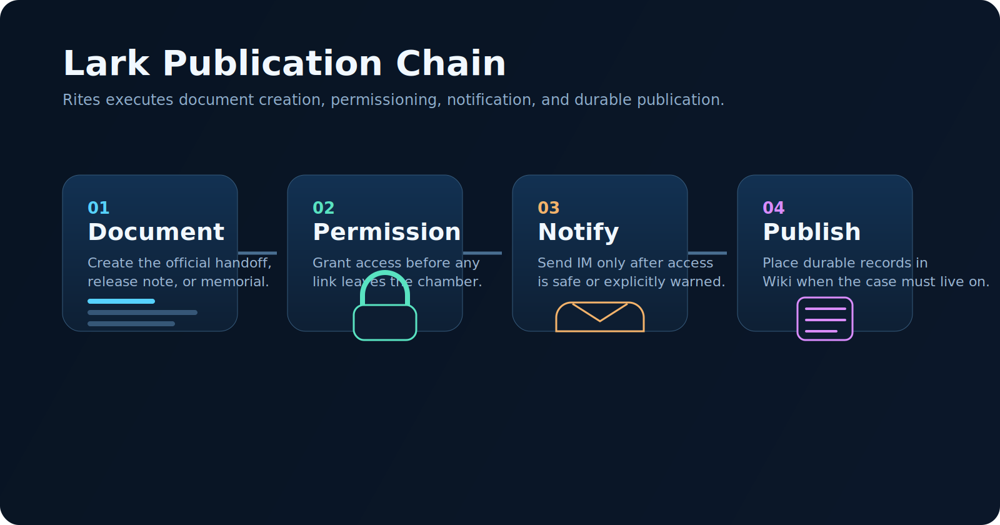

<div align="center">

# Instrument of State

**Govern Claude Code before it governs your repo.**




</div>

---

## The Problem

Most AI coding sessions do everything in one pass:

- plan
- approve
- implement
- report

That is fast, but dangerous for real repository work.

---

## The Solution

`instrument-of-state` is a **Claude Code plugin** that turns a task into a governed workflow:

- Zhongshu drafts
- Menxia reviews
- Shangshu dispatches
- Six ministries execute only when needed
- Works cannot land governed changes before approval

It is a plugin bundle, not a single skill.

---

## Court Workflow

```text
Decree -> Intake -> Recon -> Draft -> Review -> Dispatch -> Ministries -> Return -> Publish
```

| Stage | Office | What it does |
| --- | --- | --- |
| 1 | Emperor Decree | User submits the petition |
| 2 | Crown Prince Intake | Classifies mode, scope, and escalation |
| 3 | Jinyiwei Recon | Opens the docket and searches capability |
| 4 | Zhongshu | Drafts the memorial |
| 5 | Menxia | Reviews and issues the verdict |
| 6 | Shangshu | Dispatches the right ministries |
| 7 | Six Ministries | Execute only what is needed |
| 8 | Memorial Return | Integrates results into one close-out |
| 9 | Rites Publication | Publishes to Lark when needed |

<div align="center">
  
</div>

---

## Quick Start

```text
/plugin marketplace add Dick1109/instrument-of-state
/plugin install instrument-of-state
```

Then run:

```text
/instrument-of-state:shangshu-dispatch Refactor auth and keep a visible stage board.
```

---

## Main Command

| Command | Purpose |
| --- | --- |
| `/instrument-of-state:shangshu-dispatch <task>` | Main governed workflow entrypoint |

Example petitions:

```text
/instrument-of-state:shangshu-dispatch Investigate the login outage, stabilize production, and prepare a formal handoff note.
/instrument-of-state:shangshu-dispatch Redesign the pricing page with a strong visual direction and preserve accessibility.
/instrument-of-state:shangshu-dispatch Audit the release checklist and publish a Feishu handoff document.
```

---

## What It Includes

| Component | Purpose |
| --- | --- |
| `skills/` | Workflow skills such as `shangshu-dispatch`, `zhongshu-draft`, `menxia-review`, `works-delivery`, `publish-to-lark` |
| `agents/` | Shangshu, Zhongshu, Menxia, Justice, Works, Rites, and other offices |
| `hooks/` | Enforcement such as “no Works before Menxia APPROVE” |
| `bin/` | Guard and marketplace helper scripts |
| `.claude-plugin/plugin.json` | Plugin manifest |
| `.claude-plugin/marketplace.json` | Marketplace catalog manifest |

---

## Key Features

- **Visible stage board**: use a full `Imperial Stage Board` at kickoff and close-out, with compact progress digests in between to reduce terminal noise
- **Guarded delivery**: Works is blocked until Menxia returns `APPROVE`
- **Local-first capability search**: local skills/plugins -> `find-skills` -> marketplace
- **Lark publication**: Rites can create docs, grant access, send IM, and publish to Wiki
- **Frontend governance**: UI work discovers the best frontend tools through the capability ladder
- **Superpowers integration**: supporting skills are attached to the right office, not used ad hoc
---

## Frontend Rule

For UI-facing work, this plugin requires two categories of frontend capability:

- **UX structure**: accessibility, responsive behavior, layout logic, interaction quality
- **Visual design**: art direction, typography, composition, motion, anti-generic output

These capabilities are discovered dynamically through the capability ladder (global agents → session skills → find-skills → marketplace), not hardcoded to specific skill names.

---

## Lark Publication

When formal communication is needed, Rites can:

1. create the document
2. grant access
3. send IM
4. archive to Wiki

<div align="center">
  
</div>

---

## References

- [Chinese README](./README.zh-CN.md)
- [Constitution](./references/constitutional-rules.md)
- [Governance Playbook](./references/governance-playbook.md)
- [Imperial Workflow](./references/imperial-workflow.md)
- [Imperial Stage Board](./references/imperial-stage-board.md)
- [Frontend Governance](./references/frontend-governance.md)
- [Superpowers Integration](./references/superpowers-integration.md)

---

<div align="center">
Built for governed execution, visible process, and lawful delivery.
</div>
